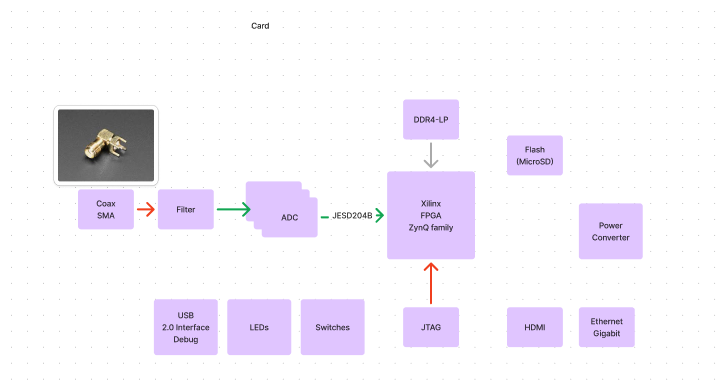

# FPGA Example Design: Xilinx Zynq Board

## TODO ##
- Should we support ethernet on v0? If so, we will need a PHY chip.
  - Patrick: We should support it if it makes bring up easier, or if
    the resulting board is practically non-sensical without it.
    We should punt it to a later version if resulting board
    is still a reasonable design without ethernet. 
- What is JESD204B? Do we need to verify whether the chosen ADC adheres to this protocol?
- Choose a power system.
- Do something about the clock? Clock generation? Clock tree?
- Support JTAG somehow.
- Support USB 2.0 somehow.

## Project Goals and Future Prospects

### Primary Objectives

- Develop an FPGA design of moderate complexity using JITX, serving as a comprehensive overview of the tool's capabilities.
- Utilize this design as a stress test to identify and resolve bugs in the JITX toolchain, while ensuring adequate performance.
- Create a compelling marketing asset: A Zynq-based board represents a significant engineering challenge. Successfully implementing this design demonstrates JITX's ability to handle complex projects, appealing to professionals already working with the Zynq platform and those engaged in projects of similar complexity.

### Future Enhancements

- Refactor the codebase to improve reusability and parameterization, with the ultimate goal of integrating it into the JSL library.
- Expand the design to interface with a VPX backplane, contingent upon the development of a VPX backplane generator. This addition would transform the project into a highly attractive example for specific industry players, such as Lockheed-Martin.
- Potential to evolve into a world-class VPX backplane solution, further enhancing JITX's market position in specialized, high-performance computing applications.

## Architecture

Here's the key components of the design:

1. Xilinx Zynq SoC
2. DDR4 memory
3. Flash memory for bring-up
4. ADC input to the FPGA, fed from a Coax connector
5. HDMI output
6. USB 2.0 and JTAG interface for bring-up and debugging

## Part Selection

### FPGA device

Considering *XCZU2CG-L1SFVC784I*:

- Supports DDR4 memory. (Lower-cost Zynq-7000 series only support up to DDR3.)
- SFVC784 package supports from U1 to U5, which means we can easily later extend to support PCIe Gen3, and GTH highspeed transceivers.
- In stock on Digikey: $406.25
- Dual core Arm Cortex-A53 (APU) + Dual core Arm Cortex-R5F (RPU)
- 103K Logic cells.

TODO: Re-verify
- 170 PS (Processing System) I/O, supporting 32-bit DDR4 only.
- 24 HD (High-Density) I/O. 58 HP (High-Performance) I/O.

Datasheet: ds891-zynq-ultrascale-plus-overview.pdf

#### Supported DDR4 memory speed

TODO: Re-verify section.

- For UBVA494 package
- For 1-rank components: Min 1000 Mb/s. Max 1866 Mb/s
- For 2-rank components w/ dual-rank package: Min 1000 Mb/s. Max 1600 Mb/s.
- For 2-rank components w/ single-rank package: Min 1000 Mb/s. Max 1333 Mb/s.

See Table 30 in *ds925-zynq-ultrascale-dc-ac-switching-characteristics.pdf*. 

#### Selecting a memory configuration

TODO: Re-verify section.

1. Memory Type: DDR4
2. Total Capacity: 4 GB (32 Gb)
3. Data Width: 32-bit
4. Component Configuration: 2 x 16Gb DDR4 chips (x16 width each)
5. Single rank
6. No ECC

This configuration uses two 16 Gb (2 GB) DDR4 chips, each with a x16 interface, to create a 32-bit wide data bus with a total capacity of 4 GB. Keep the design simple using a single rank configuration, which also allows utilization of full 1866 Mb/s speed. See Table 17-1 in *ug1085-memory-excerpt.pdf*. 

### Memory ICs

Based on above requirements Micron *MT40A1G16TD-062E AIT:F* seems to work. Currently in-stock at Digikey for $18.73.

Datasheet: micron-MT40A1G16.pdf

### Selecting an ADC ###

The ZynQ has MIO (Multiplexed I/O) and EMIO (Extended Multipled I/O) pins, with SPI available on both. 

The datasheet says that SPI performance is better using the MIO pins. (Table 28-2 in technical reference manual). 

The MIO pins can be configured for 1.8V or 3.3V signaling. (Chapter 28 in technical reference manual.)

Consider the Analog Devices *AD7091R-8BCPZ-RL7*.

- 12-bit input
- 1M samples per second
- SPI interface
- Voltage 2.09V - 5.25V

In stock for $9.93 at Digikey.

Datasheet: AD7091R.pdf

### Supporting Flash ###

Considerations:
- For simplicity: Let's use QSPI Flash for bring-up. Ensure that the flash memory chip supports QSPI. (VERIFY)
- TODO: What storage capacity do we need? Can we start with 128 MB (1 Gb)?
- Ensure that chip's operating voltage matches. The FPGA operates at 1.8V or 3.3V for I/O banks.
- Ensure FPGA supports this Flash device.

Consider *MT25QL01GBBB1EW9-0SIT TR*:

- 1Gb organized into 128Mb x 8.
- FLASH-NOR technology.
- QSPI
- 133 MHz
- In stock for $14.92 at Digikey.

Datasheet: micron-flash-mt25ql01gbbb.pdf

### Coaxial SMA Connector ###

Consider Moxel 0732511350:
- In stock for $4.22 on Digikey.
- Surface-mount solder.
- Female socket
- 50 ohm impedance.
- 18 GHz max frequency.

### Filter between Coaxial SMA Connector and ADC ###

What example application do we want to demonstrate? How about a simple Spectrum Analyzer? We'll read in the input signal, run an FFT, and display it over HDMI. 

TODO: Initial reasoning (verify)
- Nyquist frequency of a 1MSPS ADC is 500 kHZ.
- Let's stay conservative and analyze signals between 0 to 100 kHz.
- To prevent aliasing, we'll use a lowpass filter.
- Let's use an active filter to be fancy for no good reason.
- Consider *TI OPA1656IDR*:
- In stock for $2.89 at Digikey.
- We can configure it into a 2nd-order low-pass Sallen-Key filter: sallen-key-filter.pdf

Datasheet: opa1655.pdf

### Supporting USB2.0 ###

For PHY: Consider *USB3320C-EZK-TR*
- 32-VFQFN Exposed Pad
- Surface mount.
- In stock for $2.17 at Digikey.

Datasheet: usb3320.pdf

For connector: Consider Amphenol *UE27AC5410H-ND*
- In stock for $0.75 on Digikey

Datasheet: amphenol-pue27acx4x0x.pdf
