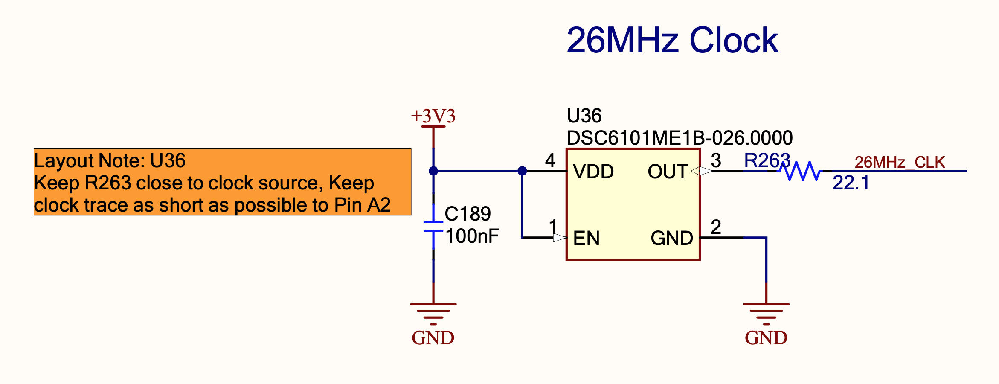

# Understanding the Reference Design #

## Documents ##

[Overview of Reference Design](../datasheets/zynq-ref-board-overview.pdf)

[Update on Reference Design](../datasheets/zynq-ref-board-update.pdf)
- Read and verify this update to the design. Previously missing termination resistor for DDR4.

[Link to Site with Documents](https://www.avnet.com/wps/portal/us/products/avnet-boards/avnet-board-families/zuboard-1cg/)

[Getting Started](../datasheets/zynq-ref-board-getting-started.pdf)

[Hardware User's Guide](../datasheets/zynq-ref-board-hw-users-guide.pdf)

[Schematic](../datasheets/zynq-ref-board-schematic.pdf)

## Overall Architecture ##

- Provides microSD.
- Connects to 1GB RAM.
- Connects to Ethernet.
- Provides JTAG/UART over microUSB.
- Provides USB2.0
- Powered by USB-C (Check whether enough for us.)
- Provides 256Mb Flash for boot

We don't need:
- Pressure & Temp sensors.
- MikroE Click expansion
- RTC
- SYZYGY expansion

## Generating the Reference Clock for the ARM Cores ##

Main component:
- U28 (DSC1525MI2A-33M33333) : Oscillator chip that produces a 33.33MHz clock signal. (VERIFY)

Power supply:
- Powered by 3.3V supply.
- C32 (100nF): Decoupling cap to reduce noise.

Enable Circuit:
- R198 (2.21K): Pull up resistor to keep EN high.

Output Circuit:
- R207 (22.1 ohm): Series termination resistor for clock trace. Keep this resistor close to OUT pin on clock chip. Keep overall trace to Pin H14 on ZynQ chip short.

## Supporting Flash ##

Main component:
- U10 (IS25WP256E-JLLE) flash memory chip.

Power supply:
- Powered by 1.8V supply.
- C31 (100nF): Decoupling cap to reduce noise.

Enable Circuit:
- R60 (4.75K): Pull-up resistor to keep CE# (Chip Enable) high.

SPI Clock input:
- SCK pin on flash chip.

Data lines:
- IO0, IO1, IO2, IO3 pins on flash chip going to MIO pins on ZynQ.

Defaults Configuration:
- WP# is Write Protect pin, active low on flash chip. (Verify)
  R65 (4.75K) pull-up resistor used to disable write protect by default.
- Hold# (Reset) is active low on flash chip. (Verify)
  R64 (4.75K) pull-up resistor used to keep it high for normal operation.

## uSD ##

Main components:
- U20 (PI4ULS3V4857): This is the voltage level translator chip. Used to convert signals between the 1.8V domain from the ZynQ to the 3.3V domain used by the SD card.
- J12 (2201778-1): The physical microSD card socket.

Power supplies:
- 1.8V supply for the ZynQ side.
- C79 (100nF): Decoupling cap for 1.8V side of level translator.
- 3.3V supply for the SD card side.
- C81 (100nF): Decoupling cap for 3.3V side of level translator.
- C208 (100nF): Decoupling cap for 3.3V supply for microSD socket.

MicroSD Spec:
- R286 (4.99K): Pull up resistor to keep CMD line high. Dictated by spec. (VERIFY)

Signal lines from ZynQ:
- MIO50_SD1_CMD: command signaled by
- MIO50_SD1_CLK: clock signal
- MIO46_SD1_DAT0, MIO47_SD1_DAT1, MIO48_SD1_DAT2, MIO49_SD1_DAT3: data signals
  These signals go into DAT0, DAT1, DAT2, DAT3 pins on microSD.

Configuring the level translator:
- R113 (0 ohm): Sets the mode of operation for the level translator. (VERIFY)

Remaining questions:
- What are the 0-ohm resistors for? How does the CardDetect circuitry work?
- What are the SWA/SWB pins on the MicroSD? What is R274 for?
- Why do the GND pins on J12 require a ferrite bead? Why don't the other GND pins need one?

## Supporting JTAG ##

### Level Translation ###

Main component:
- U24 (NVT2010PW,118): This is the voltage level translator.
  Converts 1.8V signals from FPGA to 3.3V for JTAG.
- 1.8V and 3.3V supplies connected to VREFA and VREFB pins respectively.

Signals being translated:
- JTAG signals:
  JTAG_TCK_1V8 => JTAG_TCK_3V3
  JTAG_TMS_1V8 => JTAG_TCK_3V3
  JTAG_TDI_1V8 => JTAG_TCK_3V3
  JTAG_TDO_1V8 => JTAG_TCK_3V3
- System reset:
  PS_SRST_N_1V8 => PS_SRST_N_3V3
- Power-on reset:
  PS_POR_N_1V8 => PS_POR_N_3V3
- UART transmit and receive:
  MIO11_UART0_TX_1V8 => MIO11_UART0_TX_3V3
  MIO10_UART0_RX_1V8 => MIO10_UART0_RX_3V3

Pull-up resistors:
- R184, R178, R41, R176, R39, R171, R37, R168 (4.75K): Ensure signals are high when not actively driven.

Enable circuit:
- Simple low-pass filter R42(200K) and C115(100nF) to reduce noise on EN.

Remaining questions:
- There are no decoupling caps on VREFA and VREFB. Why?

### JTAG/UART MicroUSB Connector ###

Main component:
- J16 (47589-0001): This is the 5-pin MicroUSB connector.
  - Pin USB5V0: 5V power supply from the USB.
  - Pins D- and D+: The USB data lines.
  - Pin ID: Identifies the type of USB connection.
  - Pin GND: Ground connection.

Power rails:
- USB1_5V0: This will be the 5V power supply line from the USB connector.

USB Signals:
- ULPI1_D_N, ULPI1_D_P: The USB differential data lines.

Remaining questions:
- Do we use the USB1_5V0 anywhere else on the board?
- What is the ID_JTAG_UART signal for?
- What is the C101 and 0-ohm R144 doing on the S1,S2,S3,S4 pins?

### JTAG/UART Interface ###

Main component:
- U17 (FT2232HL) is a USB to UART IC: it converts USB signals to UART and JTAG protocols.
- VREGIN: Main 3.3V input.
- VREGOUT: Integrated voltage regulator 1.8V output. This can be used to connect to VCORE with 3.3uF filter capacitor.
- VPHY: This pin powers the USB physical layer interface.
  It needs a clean 3.3V supply.
  We connect it to a dedicated 3V3_PHY supply.
- VPLL: This pin powers the internal PLL of the chip.
  It needs a very clean, low-noise 3.3V supply.
  We connect it to a dedicated 3V3_PLL supply.
- VCORE: This powers the internal core logic of the chip, and needs a 1.8V supply.
  We connect it to the integrated VREGOUT pin.
- VCCIO: This powers the I/O banks of the chip.
  Our desired I/O voltage is 3.3V so we connect it to the main 3V3 rail.
- C73 (4.7uF) and C74 (100nF) are decoupling caps for VREGIN.
- C61 (4.7uF) is the decoupling cap for VREGOUT.
- REF pin: Current reference. Specified on datasheet to be connected via 12K@1% resistor (R272) to ground.

USB Signals and ESD Protection:
- D21 (CDSOT23-SR208) is a TVS (Transient Voltage Suppressor) diode array. It protects the USB data lines (ULPI1_D_N, ULPI1_D_P) from electrostatic discharge.
- Once protected, the signal goes into the DM and DP pins on the FT2232.
- Note: Make sure during physical layout that the TVS diodes are close to the USB connector.

JTAG Signals:
- The four primary jtag signals (JTAG_TCK_3V3, JTAG_TDI_3V3, JTAG_TDO_3V3, JTAG_TMS_3V3) are output by pins ADBUS[0-3].
- R128, R129, R130, R131 (22.1 ohm) are series termination resistors for matching impedance.

Reset Signals:
- Power-on reset and system reset (PS_POR_N_3V3, PS_SRST_N_3V3) is output from ADBUS[6-7].

UART Signals:
- UART signals from fpga (MIO10_UART0_RX_3V3, MIO11_UART0_TX_3V3) connect to BDBUS[0-1].
- Note: UART transmit MIO11_UART0_TX_3V3 is *received* by FT2232HL_RX (BDBUS1).
        UART receive  MIO10_UART0_RX_3V3 is *transmitted* by FT2232HL_TX (BDBUS0).

USB suspend:
- Suspend mode detection is not used. SUSPEND pin is left floating.

Enable circuit:
- PWREN# pin is an active-low power enable. Connected to PWREN_N signal.

Unused Pins:
- ACBUS[0-7] unused.
- BDBUS[2-7] unused but go to test points for debugging.
- BCBUS[0-7] unused.

EEPROM Configuration:
- U38 (93LC56B) is a 2MHz, 2Kb EEPROM for storing configuration data for the FT2232HL chip.
- Powered by 3V3 rail connected to VCC pin. C204 (100nF) for decoupling.
- EEPROM signals connected to FT2232.
  CS (Chip Select)           -> EECS
  CLK (Clock)                -> EECLK (with R275 22.1ohm termination resistor)
  DI,DO (Data In, Data Out)  -> EEDATA (Bidirectional data line)
- DI, CLK, CS signals default to high using pull-up resistors (R276, R278, R282, 10K)
  DO default to high through an additional R283 (2K) resistor.

- Note about bidirectional data line:
  To write to EEPROM:
  - FT2232HL drives EEDATA directly.
  To read from EEPROM:
  - FT2232HL sets EEDATA to Hi-Z.
  - EEPROM then drives DO.

Clock for FT2232 chip:
- Provided by X2 (ECS-120-10-33B-CKM-TR), a 12MHz crystal with C86, C97 (18pF) load capacitors.
- Feeds into OSCI and OSCO pins.

Test mode:
- TEST pin is jumpered to GND using R265 (0-ohm).
- This sets FT2232HL to "Normal Operation Mode" instead of "Test Mode".

Remaining questions:
- What are the VREGIN and VREGOUT pins on U17. How to use them?
- How does the 5V supply from USB1_5V0 relate to this part of the schematic?
- VPHY and VPLL supplies need to be as clean as possible. Are they connected to separate regulators?
- No decoupling caps are needed for VPHY, VPLL, VCORE, VCCIO?
- Where is ID_JTAG_UART going?
- How do we correctly use the CDSOT23? What is the USB1_5V0 connection for?
- The DNP resistors R136, R133, R135, R134 for the JTAG signals ensure a default high signal. Are they necessary?
- What is the pull-up R120 on ADBUS4 for?
- What is happening to the ADBUS5 pin?
- How do we know the reset signals come out of ADBUS[6-7]?
- Why do the reset signals (PS_POR_N_3V3, PS_SRST_N_3V3) have 0-ohm jumpers and test points? Delicate place in the schematic?
- Why does BDBUS[2-7] have test points? What about the other unused pins?
- How do we program these EEPROMs on the board?
- How is the BCBUS7 power saving configuration working?
- Who sends out the PWREN_N signal? Is this for boot sequencing?
- Values of C86 and C97 load capacitors come from crystal datasheet?
- Where does the FT2232H_RST_N reset signal come from?

### Decoupling Caps ###

Questions:
- How do I know which pins these decoupling caps correspond to?
- Why are ferrite beads sometimes needed?

## Supporting USB2.0 ##

### USB 2.0 PHY ###

Main component:
- U22 (USB3321C-GL-TR): The USB 2.0 PHY controller.
- Powered by 5.0V supply via VBAT pin, and 1.8V supply via VDD18 pin (with 100nF decoupling cap C195).

Power:
- Powered by 5.0V supply via VBAT pin.
- Powered by 1.8V supply via VDD18. Spec requires a 0.1uF bypass cap to ground. (C195)
- VDD33 is a 3.3V regulator output. Spec requires a 2.2uF bypass cap to gorund. (C200)

VBus Pin:
- Dictated by datasheet, this pin connects to an external resistor (R268 10K) to the VBUS pin of the USB cable.
- Handles session request protocol for USB On-The-Go (OTG) devices.

USB Signals:
- ID Pin: Dictated by datasheet. For an A-device, this pin is grounded.
- DM,DP: D- and D+ signal pins of the USB cable.

Reset:
- RESETB Pin: Active low. Keep high for normal operation.
- USB_RST signal comes from PHY reset circuit.

Reference clock:
- REFCLK: Connect to 26MHz reference clock.

Data and control signals:
- DATA[7:0] is a ULPI bi-directional data bus. DATA[7] is MSB, Data[0] is LSB. Connects to MIO pins on ZynQ.
- STP, NXT, DIR, CLKOUT: ULPI control signals connected to ZynQ.

Bias:
- RBIAS Pin: Dictated by pin. Requires 8.06K resistor (R121) to ground.

### USB 2.0 PHY Reset ###

How it works:
- U21 (74LVC1G08GM) is a 2-input AND gate.
- Powered by 1.8V supply with 100nF decoupling cap.
- POWER_GOOD signal comes from power management circuit, and indicates when power supply is stable.
- Since other input of U21 is tied to VCC, USB_RST logically mirrors POWER_GOOD.

Remaining questions:
- What is the voltage of the POWER_GOOD signal?
- Is this circuit just a simple level translator to get that signal to 1.8V?

### 26MHz Reference Clock ###

Main component:
- U36 (DSC6101ME1B-026.0000) is a 26MHz oscillator.

Power:
- Powered by 3.3V supply with 100nF decoupling cap.

Enable:
- EN pin is tied to VDD so that oscillator is always enabled.

Clock out:
- OUT pin outputs generated clock signal.
- Connected to USB2.0 PHY controller with R263 (22.1 ohm) series terminator resistor.
- Layout notes say to keep termination resistor as close as possible to oscillator, and
  to keep clock signal trace as short as possible.

### USB 2.0 Type A Connector ###

Main component:
- J13 (USB-A-S-F-B-TH) is the USB Type A connector.

Power:
- 5.0V power supplied by VBUS pin.
- C87, C209, C84 caps for power decoupling and filtering.

USB signals:
- D-, D+ pins.

Shielding:
- C98 (100nF), R138 (300 ohm) form a simple RC filter to allow high-frequency noise to pass to ground.
- Helps reduce EMI and improve signal integrity.

Remaining questions:
- Where is USB0_5V0 used?

### Over Current Fault ###

Main component:
- U39 (MIC2009A) is a current-limited power distribution switch.

Power:
- Input power on +5V0 rail with C207 (100nF) bypass cap.
- Output power on +USB0_5V0 rail with C205 (100nF) bypass cap.

Configuration:
- R277 (240ohm) connected to ILIMIT pin. Configures current limit to 900mA.

Enable:
- Enable# pin jumpered to ground (R284). Device is always enabled.

Fault status:
- Output by MIC2009A. Logical LOW indicates switch is in current limiting mode.
- Unused. Pulled-up to +5V0.

Remaining questions:
- Is this correct? So the circuit is providing power *to* the USB device, not accepting
  power *from* it.
- Main circuit power is +5V0 rail, and is providing current-limited power on +USB0_5V0?

## Supporting DDR4 ##

### Pins on DDR4 IC ###

CK_t_A, CK_c_A, CK_t_B, CK_c_B (Input)

  CK_t and CK_c are differential clock inputs. All address, command,
  and control input signals are sampled on the crossing of the
  positive edge of CK_t and the negative edge of CK_c. AC timings for
  CA parameters are referenced to CK. Each channel (A & B) has its own
  clock pair.

CKE_A CKE_B (Input)

  Clock Enable: CKE HIGH activates and CKE LOW deactivates the
  internal clock circuits, input buffers, and output drivers.
  Power-saving modes are entered and exited via CKE transitions. CKE
  is part of the command code. Each channel (A & B) has its own CKE
  signal.

CS_A CS_B (Input)

  Chip Select: CS is part of the command code. Each channel (A & B)
  has its own CS signal.

CA[5:0]_A CA[5:0]_B (Input)

  Command/Address Inputs: CA signals provide the Command and Address
  inputs according to the Command Truth Table. Each channel (A&B) has
  its own CA signals.

ODT_CA_A ODT_CA_B (Input)

  LPDDR4 CA ODT Control: The ODT_CA pin is used in conjunction with
  the Mode Register to turn on/off the On-Die-Termination for CA pins.
  LPDDR4X CA ODT Control: The ODT_CA pin is ignored by LPDDR4X
  devices. CA ODT is fully controlled through MR11 and MR22. The
  ODT_CA pin shall be connected to either VDD2 or VSS.

DQ[15:0]_A, DQ[15:0]_B (I/O)

  Data Input/Output: Bi-direction data bus.

DQS[1:0]_t_A, DQS[1:0]_c_A, DQS[1:0]_t_B, DQS[1:0]_c_B (I/O)

  Data Strobe: DQS_t and DQS_c are bi-directional differential output
  clock signals used to strobe data during a READ or WRITE. The Data
  Strobe is generated by the DRAM for a READ and is edge-aligned with
  Data. The Data Strobe is generated by the Memory Controller for a
  WRITE and must arrive prior to Data. Each byte of data has a Data
  Strobe signal pair. Each channel (A & B) has its own DQS strobes.

DMI[1:0]_A, DMI[1:0]_B (I/O)

  Data Mask Inversion: DMI is a bi-directional signal which is driven
  HIGH when the data on the data bus is inverted, or driven LOW when
  the data is in its normal state. Data Inversion can be disabled via
  a mode register setting. Each byte of data has a DMI signal. Each
  channel (A & B) has its own DMI signals.

ZQ (Reference)

  Calibration Reference: Used to calibrate the output drive strength
  and the termination resistance. There is one ZQ pin per die. The ZQ
  should be connected to VDDQ through a 240Ω ± 1% resistor. This
  connection affects the functionality of RZQ. This is further
  described in the section on MR0 Register Information.

VDDQ, VDD1, VDD2 (Supply)

  Power Supplies: Isolated on the die for improved noise immunity.

VSS, VSSQ (GND)

  Ground Reference: Power supply ground reference

RESET_n (Input)

  RESET: When asserted LOW, the RESET_n signal resets both channels of
  the die.

### DRAM pins on ZynQ ###

The DDR I/O pins are located on bank 504 and can have a 16-bit, 32-bit
or 64-bit data path to the DRAMs depending on the device type. Bytes 0
to 1 correspond to 16-bit data, bytes 0 to 3 correspond to 32-bit
data, and bytes 0 to 7 correspond to 64-bit data. Byte 8 refers to the
ECC bits. The pins are summarized in Table 17-3. See Zynq UltraScale+
MPSoC Packaging and Pinout User Guide (UG1075) [Ref 7] for pin
assignments. The pin swap guidelines are described in Answer
Record 67330. See UltraScale Architecture PCB Design User Guide
(UG583)[Ref 15] for clamshell functionality.

Pin Name          | Direction     | Description
PS_DDR_DQ         | Input/Output  | DRAM data.
PS_DDR_DQS_P      | Input/Output  | DRAM differential data strobe positive.
PS_DDR_DQS_N      | Input/Output  | DRAM differential data strobe negative.
PS_DDR_ALERT_N    | Input         | DRAM alert signal.
PS_DDR_ACT_N      | Output        | DRAM activation command.
PS_DDR_A          | Output        | DRAM row and column address.
PS_DDR_BA         | Output        | DRAM bank address.
PS_DDR_BG         | Output        | DRAM bank group.
PS_DDR_CK_N       | Output        | DRAM differential clock negative.
PS_DDR_CK         | Output        | DRAM differential clock positive.
PS_DDR_CKE        | Output        | DRAM clock enable.
PS_DDR_CS         | Output        | DRAM chip select.
PS_DDR_DM         | Output        | DRAM data mask.
PS_DDR_ODT        | Output        | DRAM termination control.
PS_DDR_PARITY     | Output        | DRAM parity signal.
PS_DDR_RAM_RST_N  | Output        | DRAM reset signal, active Low.
PS_DDR_ZQ         | Input/Output  | ZQ calibration signal.

### Connections ###

Clock signals:
- Connect ZynQ PS_DDR_CLK pins to DDR4 CK_x_A and CK_x_B pins:
  PS_DDR_CKA_P <=> CK_t_A
  PS_DDR_CKA_N <=> CK_c_A
  PS_DDR_CKB_P <=> CK_t_B
  PS_DDR_CKB_N <=> CK_c_B

Clock Enable:
- Connect ZynQ PS_DDR_CKE0 <=> CKE0_A  and  CKE0_B

Chip Select:
- Connect ZynQ PS_DDR_CS0_N <=> CS0_A  and  CS0_B

Command/Address:
- Connect ZynQ's PS_DDR_A pins to DDR4's CA[5:0]_A and CA[5:0]_B:
  PS_DDR_CAA[5:0]  <=>  CS[5:0]_A
  PS_DDR_CAB[5:0]  <=>  CS[5:0]_B
- ZynQ DRAM bank address (PS_DDR_BA) and DRAM bank group (PS_DDR_BG) pins are unused.

Data lines:
- Connect ZynQ PS_DDR_DQ pins to DDR4's DQ[15:0]_A and DQ[15:0]_B:
  PS_DDR_DQ[15:0]  <=>  DQ[15:0]_A
  PS_DDR_DQ[31:16]  <=>  DQ[15:0]_B

Data Strobe:
- Connect ZynQ PS_DDR_DQS_P to DDR4 DQSx_c_x_A and DQSx_c_x_B:
  PS_DDR_DQSA0_N  <=>  DQS0_c_A
  PS_DDR_DQSA0_P  <=>  DQS0_t_A
  PS_DDR_DQSA1_N  <=>  DQS1_c_A
  PS_DDR_DQSA1_P  <=>  DQS1_t_A
  PS_DDR_DQSB0_N  <=>  DQS0_c_B
  PS_DDR_DQSB0_P  <=>  DQS0_t_B
  PS_DDR_DQSB1_N  <=>  DQS1_c_B
  PS_DDR_DQSB1_P  <=>  DQS1_t_B
  
Data Mask:
- Connect ZynQ's PS_DDR_DM to DDR4's DMI[1:0]_A and DMI[1:0]_B:
  PS_DDR_DMA[1:0]  <=>  DMI[1:0]_A
  PS_DDR_DMB[1:0]  <=>  DMI[1:0]_B
  
On-Die Termination:
- Per-datasheet: "The ODT_CA pin is ignored by LPDDR4X devices. The
  ODT_CA pin shall be connected to either VDD2 or VSS."
- ODT_CA_A and ODT_CA_B pulled-up to +1V1 via R239 (4.75K) PS_DDR_ODT

Reset:
- Connect ZynQ PS_DDR_RAM_RST_N to RESET_n:
  PS_DDR_RST_N  <=>  RESET_n
- R257 (4.75K) is pull-down resistor to default low. (RAM is default in reset state.)

ZQ Calibration:
- Per datasheet: "The ZQ should be connected to VDDQ through a 240Ω ± 1% resistor".
- Done by R95.

Power:
- Connect VDDQ, VDD2 to +1V1 rail.
- Connect VDD1 to +1V8 rail.
- Connect VSS to ground.

Unused Zynq signals:
- PS_DDR_ACT_N (DRAM activation command.)
- PS_DDR_ALERT_N (DRAM alert signal.)
- PS_DDR_PARITY (DRAM parity signal.)
- PS_DDR_ZQ (ZQ calibration signal.)

Remaining questions:
- Is it normal to pull-down to default to reset state?
- Unused Chip select and clock enable:
  PS_DDR_CS1_n and PS_DDR_CKE1 connected to "NC" pins.
  What does this mean?
- ERR_A and ERR_B pins on DDR4 are not in pin-out table. Assumed to be output? Goes to DNP pin header.
- ZynQ's PS_DDR_ZQ signal unused?
- How do I know which pins the decoupling caps correspond to? Where do I put them?
  How were they chosen?

## Supporting USB-C Power Input ##

TODO ...

## Power Supplies ##

TODO ...

## Supporting Ethernet ##

TODO ...

## On/Off Controller ##

TODO ...
